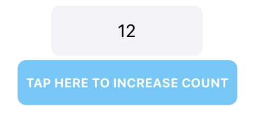

# CoreRender [](#) [](#) [](https://opensource.org/licenses/MIT)


CoreRender is a SwiftUI inspired API for UIKit (that is compatible with iOS 10+ and ObjC).


### Introduction

* **Declarative:** CoreRender uses a declarative API to define UI components. You simply describe the layout for your UI based on a set of inputs and the framework takes care of the rest (*diff* and *reconciliation* from virtual view hierarchy to the actual one under the hood).
* **Flexbox layout:** CoreRender includes the robust and battle-tested Facebook's [Yoga](https://facebook.github.io/yoga/) as default layout engine.
* **Fine-grained recycling:** Any component such as a text or image can be recycled and reused anywhere in the UI.

### TL;DR

Let's build the classic *Counter-Example*.

The DSL to define the vdom representation is similiar to SwiftUI.

```swift
func makeCounterBodyFragment(context: Context, coordinator: CounterCoordinator) -> OpaqueNodeBuilder {
  VStackNode {
    LabelNode(text: "\(coordinator.state.count)")
      .textColor(.darkText)
      .background(.secondarySystemBackground)
      .width(Const.size + 8 * CGFloat(coordinator.state.count))
      .height(Const.size)
      .margin(Const.margin)
      .cornerRadius(Const.cornerRadius)
    HStackNode {
      ButtonNode()
        .text("TAP HERE TO INCREASE COUNT")
        .setTarget(coordinator, action: #selector(CounterCoordinator.increase), for: .touchUpInside)
        .background(.systemTeal)
        .padding(Const.margin * 2)
        .cornerRadius(Const.cornerRadius)
    }
  }
  .alignItems(.center)
  .matchHostingViewWidth(withMargin: 0)
}
```



`Label` and `Button` are just specialized versions of the `Node<V: UIView>` pure function.
That means you could wrap any UIView subclass in a vdom node. e.g.
```swift

Node(UIScrollView.self) {
  Node(UILabel.self).withLayoutSpec { spec in 
    // This is where you can have all sort of custom view configuration.
  }
  Node(UISwitch.self)
}

```
The `withLayoutSpec` modifier allows to specify a custom configuration closure for your view.

 `Coordinators`  are the only non-transient objects in CoreRender. They yeld the view internal state and 
 they are able to manually access to the concrete view hierarchy (if one desires to do so).
 
 By calling  `setNeedsReconcile`  the vdom is being recomputed and reconciled against the concrete view hiearchy.

```swift
class CounterCoordinator: Coordinator{
  var count: UInt = 0

  func incrementCounter() {
    self.count += 1                      // Update the state.
    setNeedsReconcile()                  // Trigger the reconciliation algorithm on the view hiearchy associated to this coordinator.
  }
}
```

Finally,  `Components` are yet again transient value types that bind together a body fragment with a
given coordinator.

```swift
class CounterViewCoordinator: UIViewController {
  var hostingView: HostingView!
  let context = Context()

  override func loadView() {
    hostingView = HostingView(context: context, with: [.useSafeAreaInsets]) { context in
      Component<CounterCoordinator>(context: context) { context, coordinator in
        makeCounterBodyFragment(context: context, coordinator: coordinator)
      }.builder()
    }
    self.view = hostingView
  }
    
  override func viewDidLayoutSubviews() {
    hostingView.setNeedsLayout()
  }
}
```

Components can be nested in the node hierarchy.

```swift

func makeFragment(context: Context) {
  Component<FooCoordinator>(context: context) { context, coordinator in
    VStackNode {
      LabelNode(text: "Foo")
      Component<BarCoordinator>(context: context) { context, coordinator in
        HStackNode {
          LabelNode(text: "Bar")
          LabelNode(text: "Baz")
        }
      }
    }
  }
}

```
