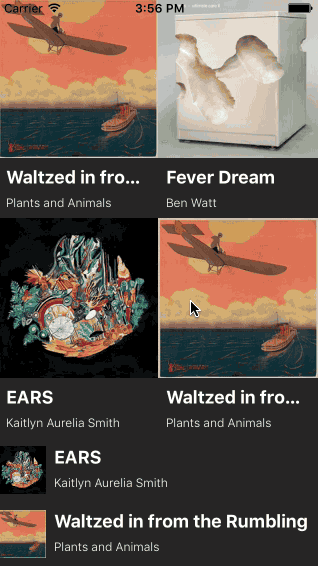

[](https://github.com/Carthage/Carthage)
[](#)
[](#)
[](https://opensource.org/licenses/MIT)

*React-inspired swift library for writing UIKit UIs which are functions of their state.*

#Why

from [Why React matters](http://joshaber.github.io/2015/01/30/why-react-native-matters/):

[The framework] lets us write our UIs.


Right now we write UIs by poking at them, manually mutating their properties when something changes, adding and removing views, etc. This is fragile and error-prone. [...]

[The framework] let us describe our entire UI for a given state, and then it does the hard work of figuring out what needs to change. It abstracts all the fragile, error-prone code out away from us. 

## Installation

### Carthage


To install Carthage, run (using Homebrew):

```bash
$ brew update
$ brew install carthage
```

Then add the following line to your `Cartfile`:

```
github "alexdrone/Render" "master"    
```

#TL;DR

**Render**'s building blocks are *Components* (described in the protocol `ComponentViewType`).


Despite virtually any `UIView` object can be a component (as long as it conforms to the above-cited protocol),
**Render**'s core functionalities are exposed by the two main Component base classes: `ComponentView` and `StaticComponentView` (optimised for components that have a static view hierarchy).

**Render** layout engine is based on [FlexboxLayout](https://github.com/alexdrone/FlexboxLayout).

This is what a component (and its state) would look like:


```swift

struct MyComponentState: ComponentStateType {
	let title: String
	let subtitle: String
	let image: UIImage  
	let expanded: Bool
}

// COMPONENT
class MyComponentView: ComponentView {
    
    // The component state.
    var componentState: MyComponentState? {
        return self.state as? MyComponentState
    }
    
    // View as function of the state.
    override func construct() -> ComponentNodeType {
            
        return ComponentNode<UIView>().configure({
        		$0.style.flexDirection = self.componentState.expanded ? .Row : .Column
            	$0.backgroundColor = UIColor.blackColor()

        }).children([
            
            ComponentNode<UIImageView>().configure({
				$0.image = self.componentState?.image
				let size = self.componentState.expanded ? self.parentSize.width : 48.0
				$0.style.dimensions = (size, size)
            }),
            
            ComponentNode<UIView>().configure({ 
            		$0.style.flexDirection = .Column
            		$0.style.margin = (8.0, 8.0, 8.0, 8.0, 0.0, 0.0)
                
            }).children([
                
                ComponentNode<UILabel>().configure({ 
                		$0.text = self.componentState?.title ?? "None"
                		$0.font = UIFont.systemFontOfSize(18.0, weight: UIFontWeightBold)
                		$0.textColor = UIColor.whiteColor()
                }),
                
                ComponentNode<UILabel>().configure({
                		$0.text = self.componentState?.subtitle ?? "Subtitle"
                		$0.font = UIFont.systemFontOfSize(12.0, weight: UIFontWeightLight)
                		$0.textColor = UIColor.whiteColor()                		
                })
            ]),
         
            // This node will be part of the tree only when expanded == false. *
            when(!self.componentState?.expanded, ComponentNode<UILabel>().configure({
                $0.style.justifyContent = .FlexEnd
                $0.text = "2016"
                $0.textColor = UIColor.whiteColor()
            }))

        ])
    }
    
}

```
<sup> * This can also be accomplished with a `StaticComponentView` by setting the `hidden` property in the configuration closure. </sup>


The view description is defined by the `construct()` method.

`ComponentNode<T>` is an abstraction around views of any sort that knows how to build, configure and layout the view when necessary.

Every time `renderComponent()` is called, a new tree is constructed, compared to the existing tree and only the required changes to the actual view hierarchy are performed - *if you have a static view hierarchy, you might want to inherit from `StaticComponentView` to skip this part of the rendering* . Also the `configure` closure passed as argument is re-applied to every view defined in the `construct()` method and the layout is re-computed based on the nodes' flexbox attributes. 

The component above would render to:

<p align="center">


###Lightweight Integration with UIKit

*Components* are plain UIViews, so they can be used inside a vanilla view hierarchy with *autolayout* or *layoutSubviews*.
Similarly plain vanilla UIViews (UIKit components or custom ones) can be wrapped in a `ComponentNode` (so they can be part of a `ComponentView` or a `StaticComponentView`).

The framework doesn't force you to use the Component abstraction. You can use normal UIViews with autolayout inside a component or vice versa. This is probably one of the biggest difference from Facebook's `ComponentKit`.

###Performance & Thread Model

**Render**'s `renderComponent()` function is performed on the main thread. Diff+Layout+Configuration runs usually under 16ms on a iPhone 4S, which makes it suitable for cells implementation (with a smooth scrolling).

###Live Refresh
You can use **Render** with [Injection](https://github.com/johnno1962/injectionforxcode) in order to have live refresh of your components.
Install the injection plugin, patch your project for injection and add this code inside your component class (or in your viewcontroller):

```swift

class MyComponentView: ComponentView {
	...
	func injected() {
		self.renderComponent()
	}
}

```

###Backend-driven UIs

Given the descriptive nature of **Render**'s components, components can be defined in JSON or XML files and downloaded on-demand.
*The ComponentDeserializer is being worked on as we speak*.


#Cells 

You can wrap your components in `ComponentTableViewCell` or `ComponentCollectionViewCell` and use the classic dataSource/delegate pattern for you view controller.


```swift
class ViewControllerWithTableView: UIViewController, UITableViewDataSource, UITableViewDelegate {  
    var tableView: UITableView = ...
    var posts: [Post] = ... 
  
    override func viewDidLoad() {
        super.viewDidLoad()
  
        //ComponentTableViewCell works with 'UITableViewAutomaticDimension'
        self.tableView.rowHeight = UITableViewAutomaticDimension
        self.tableView.estimatedRowHeight = //..Setting this will dramatically improve reloadData() perf

        self.tableView.dataSource = self
        self.tableView.delegate = self
        self.view.addSubview(self.tableView)
    }

    func tableView(tableView: UITableView, numberOfRowsInSection section: Int) -> Int {
        return self.posts.count
    }
    
    func tableView(tableView: UITableView, didSelectRowAtIndexPath indexPath: NSIndexPath) {
        self.posts[indexPath.row]... //change the state for the selected index path

        //render the component for the cell at the given index
        self.tableView.renderComponentAtIndexPath(indexPath)
    }
    
    func tableView(tableView: UITableView, cellForRowAtIndexPath indexPath: NSIndexPath) -> UITableViewCell {
      let reuseIdentifier = "PostComponentCell"
      let cell: ComponentCell! =  
            //dequeue a cell with the given identifier 
            //(remember to use different identifiers for different component classes)
            tableView.dequeueReusableCellWithIdentifier(reuseIdentifier) as? ComponentCell ??
        
            //or create a new Cell wrapping the component
            ComponentCell(reuseIdentifier: reuseIdentifier, component: PostComponent())
                  
      //set the state for the cell
      cell.state = self.posts[indexPath.row]
      
      //and render the component
      cell.renderComponent(CGSize(tableView.bounds.size.width))
        
      return cell
    }
}
```

#ComponentTableView/CollectionView

Although the approach shown above works perfectly, it does clashes with the React-like component pattern.
`ComponentTableView` and `ComponentCollectionView` expose the same interface and work with a simple array of `ListComponentItemType` (see also `ListComponentItem<ComponentViewType, ComponentStateType>: ListComponentItemType`).
ComponentTableView/CollectionView takes care of cell reuse for you and apply a diff algorithm when the `items` property is set (so that proper insertions/deletions are performed rather than reloadData()).


The example below shows the use of ComponentCollectionView.

```swift
class ViewController: UIViewController {

    // The item list.
    var items: [ListComponentItemType] = [ListComponentItem<MyComponentView, MyComponentState>]() {
        didSet {
        		// render the list when the items change
             self.listComponentView.renderComponent()
        }
    }

    let listComponentView = ComponentCollectionView()

    override func viewDidLoad() {
        super.viewDidLoad()

        // generate some fake data
        self.createDummyData()
        
        // configure the list component.
        self.listComponentView.configure() { view in
            view.frame.size = view.parentSize
            view.items = self.albums
        }
        
        self.view.addSubview(self.listComponentView)
    }
    
    func createDummyData() {
        for _ in 0..<10 {
        
        		// ListComponentItem<COMPONENT,STATE> informs the list what component is used for the 
        		// given state.
           	let item = ListComponentItem<MyComponentView, MyComponentState>()
           	item.delegate = self
           	self.items.append(item)
        }
    }
}

extension ViewController: ListComponentItemDelegate {
    
    func didSelectItem(item: ListComponentItemType, indexPath: NSIndexPath, listComponent: ComponentViewType) {
    
    		// if the item is expanded we collapse it
    		if let item = item as? ListComponentItem<AlbumComponentView, Album> where item.state.expanded {
    			item.state.expanded = false
    			self.listComponentView.renderComponentAtIndexPath(indexPath)
    
    		// otherwise we remove the item from the list
    		} else {
    	        self.items = self.items.filter({ $0.state != item.state })
		}
    }
}
```
<sup> Check the demo project! </sup>

<p align="center">


#TODO:
	- Proper documentation and getting started guide.
	- Deserialize Components and ListComponentItems from JSON/XML.


#Credits

- [React](https://github.com/facebook/react): The React github page
- [Few.swift](https://github.com/joshaber/Few.swift): Another React port for Swift. Check it out!
- [css-layout](https://github.com/facebook/css-layout): This project used the C src code for the flexbox layout engine.
- [Dwifft](https://github.com/jflinter/Dwifft): A swift array diff algorithm implementation.
- [Backend-driven native UIs](https://www.facebook.com/atscaleevents/videos/1708052886134475/) from [JohnSundell](https://github.com/JohnSundell): A inspiring video about component-driven UIs (the demo project is also inspired from Spotify's UI).


