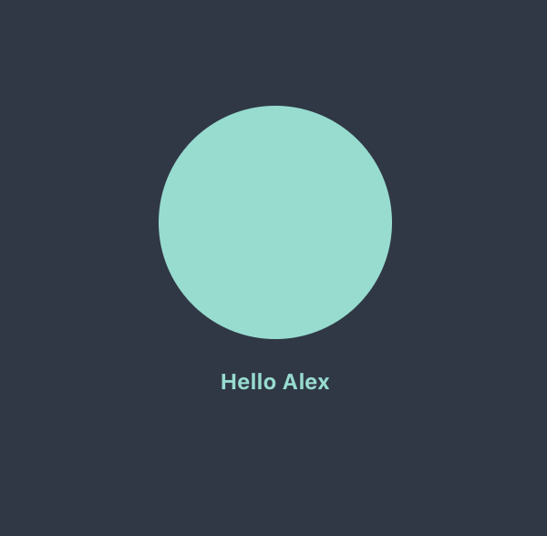
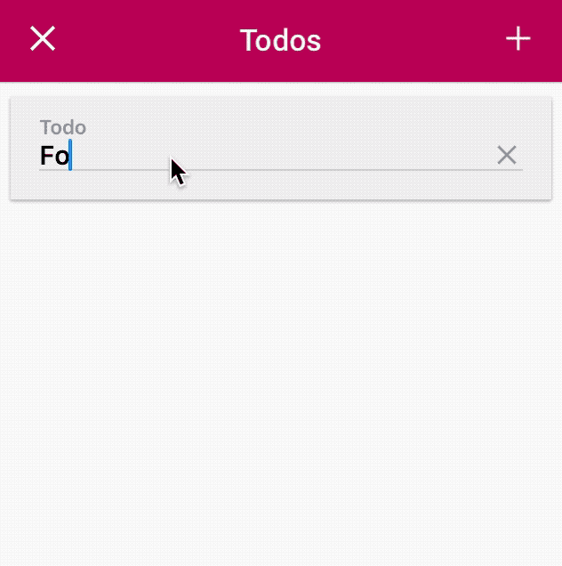
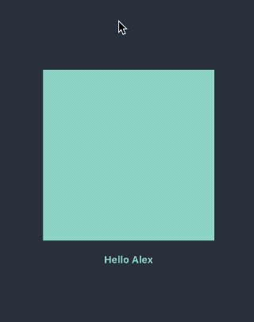

# 

[](#)
[](https://github.com/Carthage/Carthage)
[](#)
[](https://opensource.org/licenses/MIT)
[](https://gitter.im/alexdrone/Render?utm_source=badge&utm_medium=badge&utm_campaign=pr-badge)

*React-inspired Swift library for writing UIKit UIs.*


## Why

- In render a view is a simple function of the application state inspired from React/Elm architectures.
- Diff and reconciliation from the virtual view hierarchy to the actual one under the hood.
- Battle tested flexbox layout engine ([Yoga](https://facebook.github.io/yoga/)) from Facebook (used in popular frameworks like React Native).

From [Why React matters](http://joshaber.github.io/2015/01/30/why-react-native-matters/):

>  [The framework] lets us write our UIs as pure function of their states.
> 
>  Right now we write UIs by poking at them, manually mutating their properties when something changes, adding and removing views, etc. This is fragile and error-prone. [...]
> 
> [The framework] lets us describe our entire UI for a given state, and then it does the hard work of figuring out what needs to change. It abstracts all the fragile, error-prone code out away from us. 

## Installation

If you are using **CocoaPods**:


Add the following to your [Podfile](https://guides.cocoapods.org/using/the-podfile.html):

```ruby
pod 'Render', '~> 2.1'
```

If you are using **Carthage**:


To install Carthage, run (using Homebrew):

```bash
$ brew update
$ brew install carthage
```

Then add the following line to your `Cartfile`:

```
github "alexdrone/Render" "master"    
```

Manually:

Download and drop ```/Render``` folder in your project.  

Remember to import the Render framework in your source files.


``` swift
import UIKit
import Render
```

# TL;DR

**Render**'s building blocks are *Components* (described in the protocol `ComponentViewType`) and its layout engine is based on [Yoga](https://facebook.github.io/yoga/).

This is what a component looks like:


```swift

struct HelloWorldState: StateType {
  let name: String
}

class HelloWorldComponentView: ComponentView<HelloWorldState> {

  override func construct(state: HelloWorldState?, size: CGSize = CGSize.undefined) -> NodeType {
    let avatar = Node<UIImageView> { (view, layout, size) in
      let radius: CGFloat = 64
      view.backgroundColor = Color.green
      view.layer.cornerRadius = radius
      layout.height = radius * 2
      layout.width = radius * 2
      layout.alignSelf = .center
    }
   
    let text = Node<UILabel> { (view, layout, size) in
      view.text = "Hello \(state?.name)"
      view.textAlignment = .center
      view.textColor = Color.green
      layout.margin = 16
    }
		
    let container = Node<UIImageView> { (view, layout, size) in
      view.backgroundColor = Color.black
      layout.width = min(size.width, size.height)
      layout.height = layout.width
      layout.justifyContent = .center
    }

    return container.add(children: [
      avatar,
      text
    ])
  }
}
...

let component = HelloWorldComponentView()
component.state = HelloWorldState(name: "Alex")
component.render(in: self.view.bounds.size)

```

The view description is defined by the `construct(state:size:)` method.

`Node<T>` is an abstraction around views of any sort that knows how to build, configure and layout the view when necessary.

Every time `render(in:options:)` is called, a new tree is constructed, compared to the existing tree and only the required changes to the actual view hierarchy are performed - *if you have a static view hierarchy, you might want pass the '.preventViewHierarchyDiff' option to skip this part of the rendering* . Also the `configure` closure passed as argument is re-applied to every view defined in the `construct()` method and the layout is re-computed based on the nodes' flexbox attributes. 

The component above would render to:



**Check the demo project for more examples**


### Lightweight Integration with UIKit

*Components* are plain UIViews, so they can be used inside a vanilla view hierarchy with *autolayout* or *layoutSubviews*.
Similarly plain vanilla UIViews (UIKit components or custom ones) can be wrapped in a `Node`.


The framework doesn't force you to use the Component abstraction. You can use normal UIViews with autolayout inside a component or vice versa. This is probably one of the biggest difference from Facebook's `ComponentKit`.

### Performance & Thread Model

**Render**'s `render(in:options:)` function is performed on the main thread. Diff+Reconciliation+Layout+Configuration runs usually under 16ms for a component with a complex view hierarchy on a iPhone 4S, which makes it suitable for cells implementation (with a smooth scrolling).


### Components embedded in cells

You can wrap your components in `ComponentTableViewCell` or `ComponentCollectionViewCell` and use the classic dataSource/delegate pattern for you view controller.

### Declarative UITableView implementation

You can quickly leverage the efficiency of UITableView and its cell reuse capabilities by using **TableNode** as the container node for your children.
In this way the node's subnodes will be wrapped inside UITableViewCollectionCells.

```swift

 override func construct(state: State?, size: CGSize) -> NodeType {
    let table = TableNode() { (view, layout, size) in
      layout.width = size.width
      layout.height = size.height
    }
    return table.add(children: [
      // Any node definition will be wrapped inside a UITableViewCell.
      Node<UIView> { (view, layout, size) in
        layout.width = size.width
        layout.height = 300
      },
      // Another one..
      Node<UIView> { (view, layout, size) in
        ...
      },
      // ComponentViews can also be added to the TableNode.
      MyComponent().construct(state: MyState(), size: size)
    ])
  }

```

### Samples

 - Catalogue app 

 

 - Todolist app

<table border="0" cellspacing="0" cellpadding="0">
<tr><td></td><td></td></tr>
</table>


#### Use with Buffer

[Buffer](https://github.com/alexdrone/Buffer) is a μ-framework for efficient array diffs, collection observation and data source implementation.
It exposes a declarative API for UITableView and UICollectionView.
This is an example of how to use Buffer with Render's ComponentViews.

```swift

import Buffer
import Render

class ViewController: UIViewController {

  let tableView =  TableView<FooModel>()

  lazy var elements: [AnyListItem<FooState>] = {
    return (0...100).map { _ in
      // AnyListItem wraps the data and the configuration for every row in the tableview.
      let item = AnyListItem(type: ComponentTableViewCell<FooState>.self, state: FooState(text: "Foo")) { cell, state in
        cell.mountComponentIfNecessary(FooComponentView())
        cell.state = state
        cell.render(in: self.tableView.bounds.size)
      }
    }
  }()

  override func viewDidLoad() {
    super.viewDidLoad()
    self.view.addSubview(self.tableView)

    // Simply set the elements for the table view.
    self.tableView.elements = self.elements
  }
}

```

#### Use with Dispatch

[Dispatch](https://github.com/alexdrone/Dispatch) is a Flux-like implementation of the unidirectional data flow architecture in Swift.
In this architecture views are simple function of your state - this works especially well with Render's declarative programming style.

Checkout the **TodoApp** example to see how to get the best out of **Dispatch** and **Render**.

#### Use with ReSwift

[ReSwift](https://github.com/ReSwift/ReSwift) is a Redux-like implementation of the unidirectional data flow architecture in Swift. 

```swift

import Render
import ReSwift

class HelloWorldComponentView: ComponentView<AppState>, StoreSubscriber {
  override func construct(state: AppState?, size: CGSize = CGSize.undefined) -> NodeType { ... }
	
  func newState(state: AppState) {
    self.state = state
    self.render()
  }	
}

```


# LICENSE

- [Yoga](https://facebook.github.io/yoga/)
- [React](https://github.com/facebook/react): The React github page


