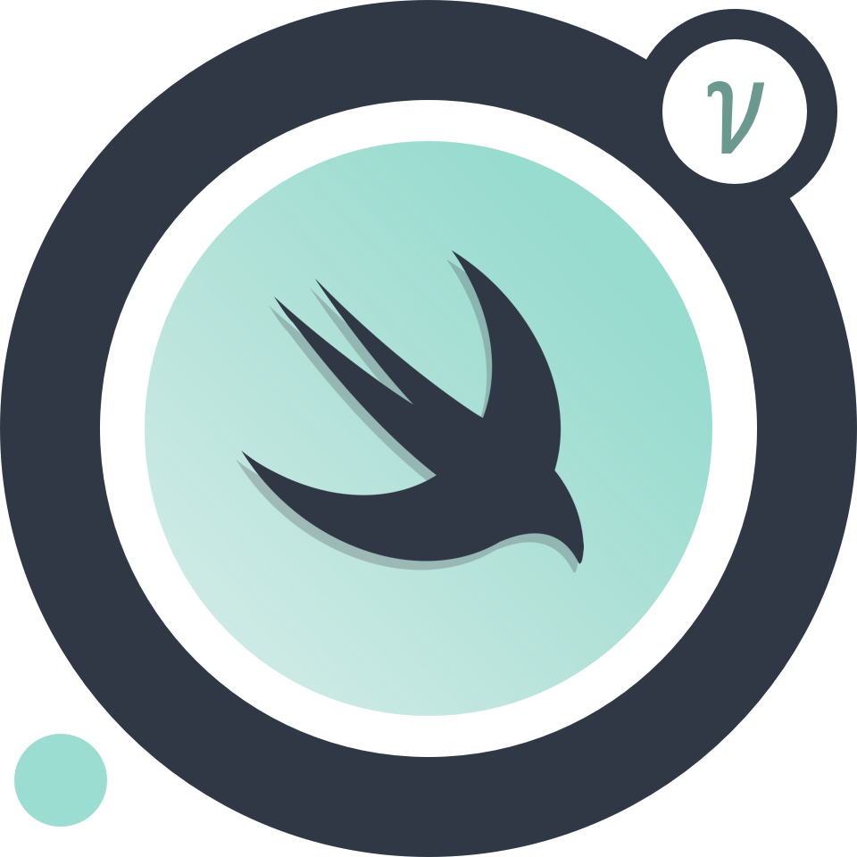

# Render Neutrino [](#) [](#) [](https://opensource.org/licenses/MIT)



Render is a declarative library for building efficient UIs on iOS inspired by [React](https://github.com/facebook/react).


*Render Neutrino* is the new version of Render, re-built from the ground up ([4.*  release here](https://github.com/alexdrone/Render/tree/classic))

* **Declarative:** Render uses a declarative API to define UI components. You simply describe the layout for your UI based on a set of inputs and the framework takes care of the rest (*diff* and *reconciliation* from virtual view hierarchy to the actual one under the hood).
* **Flexbox layout:** Render includes the robust and battle-tested Facebook's [Yoga](https://facebook.github.io/yoga/) as default layout engine.
* **Fine-grained recycling:** Any component such as a text or image can be recycled and reused anywhere in the UI.

From [Why React matters](http://joshaber.github.io/2015/01/30/why-react-native-matters/):

>  [The framework] lets us write our UIs as pure function of their states.
>
>  Right now we write UIs by poking at them, manually mutating their properties when something changes, adding and removing views, etc. This is fragile and error-prone. [...]
>
> [The framework] lets us describe our entire UI for a given state, and then it does the hard work of figuring out what needs to change. It abstracts all the fragile, error-prone code out away from us.

### Installing the framework

If you are using **CocoaPods**:


Add the following to your [Podfile](https://guides.cocoapods.org/using/the-podfile.html):

```ruby
pod 'RenderNeutrino'
```

* Remember to set `use_frameworks!` in your **Podfile** to tell Cocoapods to use Frameworks instead of Static Libraries. 

If you are using **Carthage**:


Add the following line to your `Cartfile`:

```
github "alexdrone/Render" "master"    
```

**Manually**:

```
cd {PROJECT_ROOT_DIRECTORY}
curl "https://raw.githubusercontent.com/alexdrone/Render/master/bin/dist.zip" > render_neutrino_dist.zip && unzip render_neutrino_dist.zip
```

Drag `RenderNeutrino.framework` in your project and add it as an embedded binary.

# Documentation:

#### [Getting started](docs/getting_started.md)
#### [Components life-cycle](docs/components_lifecycle.md)
#### [TableViews and CollectionViews *(doc in progress)*](docs/tableviews.md)
#### [Layouts](https://yogalayout.com/playground)
#### [Animations *(doc in progress)*](docs/animations.md)
#### [Component-based Navigation bar *(doc in progress)*](docs/navigation_bar.md)
#### [Mod: Stylesheet and Hot-Reload *(doc in progress)*](docs/mod_stylesheet.md)
#### [Mod: Inspector *(doc in progress)*](docs/mod_inspector.md)


# Credits:
Layout engine:

* [facebook/yoga](https://github.com/facebook/yoga)

In the Stylesheet Mod:

* [yaml/libyaml](https://github.com/yaml/libyaml)
* [nicklockwood/Expression](https://github.com/nicklockwood/Expression)

