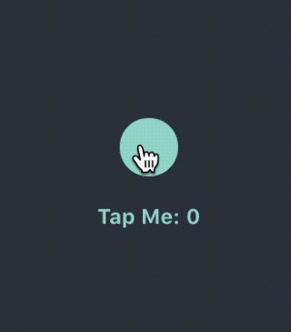

# Render [](#) [](#) [](https://opensource.org/licenses/MIT)


Render is a declarative library for building efficient UIs on iOS inspired by [React](https://github.com/facebook/react).

* **Declarative:** Render uses a declarative API to define UI components. You simply describe the layout for your UI based on a set of inputs and the framework takes care of the rest (*diff* and *reconciliation* from virtual view hierarchy to the actual one under the hood).
* **Flexbox layout:** Render includes the robust and battle-tested Facebook's [Yoga](https://facebook.github.io/yoga/) as default layout engine.
* **Fine-grained recycling:** Any component such as a text or image can be recycled and reused anywhere in the UI.

From [Why React matters](http://joshaber.github.io/2015/01/30/why-react-native-matters/):

>  [The framework] lets us write our UIs as pure function of their states.
> 
>  Right now we write UIs by poking at them, manually mutating their properties when something changes, adding and removing views, etc. This is fragile and error-prone. [...]
> 
> [The framework] lets us describe our entire UI for a given state, and then it does the hard work of figuring out what needs to change. It abstracts all the fragile, error-prone code out away from us. 

## Installation

If you are using **CocoaPods**:


Add the following to your [Podfile](https://guides.cocoapods.org/using/the-podfile.html):

```ruby
pod 'Render'
```

If you are using **Carthage**:


Add the following line to your `Cartfile`:

```
github "alexdrone/Render" "master"    
```

Manually:

Drag `bin/Render.framework` in your project and add it as an embedded binary.


# TL;DR

**Render**'s building blocks are *Components* (described in the protocol `ComponentViewType`) and its layout engine is based on [Yoga](https://facebook.github.io/yoga/).

This is what a component looks like:


```swift

struct HelloWorldState: StateType {
  let count: Int
  let image: UIImage
}

class HelloWorldComponentView: ComponentView<HelloWorldState> {

  init() {
    self.state = HelloWorldState(count: 0, image: UIImage());
  }

  override func render() -> NodeType {
    let avatar = Node<UIImageView> { view, layout, size in
      view.image = state.image
      layout.alignSelf = .center
      (layout.width, layout.height) = (128, 128) 
    }
   
    let text = Node<UILabel> { view, layout, size in
      view.text = "Tap Me: \(state.count)"
      view.textAlignment = .center
      layout.margin = 16
    }
		
    let container = Node<UIImageView> { view, layout, size in
      view.backgroundColor = Color.black
      view.onTap { [weak self] _ in
      	// When the state changes the component is automatically re-rendered.
        self?.setState { 
          $0.count += 1
        }
      }
      layout.justifyContent = .center
    }

    return container.add(children: [
      avatar,
      text
    ])
  }
}

// ...

let component = HelloWorldComponentView()
self.view.addSubview(component)
```

The view description is defined by the `render()` method.

`Node<T>` is an abstraction around views of any sort that knows how to build, configure and layout the view when necessary.

Every time `update(options:)` is called, a new tree is constructed, compared to the existing tree and only the required changes to the actual view hierarchy are performed - *if you have a static view hierarchy, you might want pass the '.preventViewHierarchyDiff' option to skip this part of the rendering* . Also the `configure` closure passed as argument is re-applied to every view defined in the `render()` method and the layout is re-computed based on the nodes' flexbox attributes. 

The component above would render to:



**Check the demo project for more examples**

Components in *Render* are designed to be **stateful** *(although you can have a `ComponentView<NilState>` if you wish)* but often is easier to simplify you render logic by having simple pure functions returning a `NodeType`.
In this way you can better manage the complexity of your component and efficently share logic between those.

```swift

 func paddedLabel(text: String) -> NodeType {
    // A box around the label with a little padding.
    return Node<UIView>(key: "paddedLabel") { view, layout, _ in
      layout.padding = 4
      view.backgroundColor = Color.green
      }.add(children: [
        Node<UILabel> { view, _, _ in
          view.text = text
          view.numberOfLines = 0
          view.textColor = Color.darkerGreen
          view.font = Typography.small
        }
    ])
  }
  
class MyComponentView: ComponentView<MyState> {
  func render() -> NodeType {
    return Node<UIScrollView>.add(children: [
        paddedLabel(text: "foo"),
        paddedLabel(text: "bar"),
        paddedLabel(text: "baz"),
      ])
    }
  }
  
```

*Render* strongly reccomend to use flexbox (**Yoga**) to layout views but you can opt out any node from the layout engine and layout the view in the `onLayout(duration:)` method.

```swift


class ExampleComponentView: ComponentView<NilState> {

  override func render() -> NodeType {
  
    // Nodes with flex layout defined 
    let avatar = Node<UIImageView>(key: "avatar") ...
    let text = Node<UILabel>(key: "text") ..
    let container = Node<UIImageView>(key: "container") ...
    
    let viewWithManualLayout = Node<UIView>(key: "circle") { view, _, _ in
    	view.yoga.isIncludedInLayout = false
      	view.backgroundColor = UIColor.red
    }

    return container.add(children: [
      avatar,
      text,
      circle
    ])
  }
  
  override func onLayout(duration: TimeInterval) {
    guard let circle = views(type: UIView.self, key: Key.circle.rawValue).first,
          let avatar = views(type: UIImageView.self, key: Key.avatar.rawValue).first else  {
      return
    }
    let size: CGFloat = avatar.bounds.size.width/2
    circle.frame.size =  CGSize(width: size, height: size)
    circle.center = avatar.center
  }
}
```


### Lightweight Integration with UIKit

*Components* are plain UIViews, so they can be used inside a vanilla view hierarchy with *autolayout* or *layoutSubviews*.
Similarly plain vanilla UIViews (UIKit components or custom ones) can be wrapped in a `Node`.


The framework doesn't force you to use the Component abstraction. You can use normal UIViews with autolayout inside a component or vice versa. This is probably one of the biggest difference from Facebook's `ComponentKit`.

### Performance & Thread Model

**Render**'s `update(options:)` function is performed on the main thread. Diff+Reconciliation+Layout+Configuration runs usually under 16ms for a component with a complex view hierarchy on a iPhone 4S, which makes it suitable for cells implementation (with a smooth scrolling).


### Components embedded in cells

You can wrap your components in `ComponentTableViewCell` or `ComponentCollectionViewCell` and use the classic dataSource/delegate pattern for you view controller.

### Declarative UITableView implementation

You can quickly leverage the efficiency of UITableView and its cell reuse capabilities by using **TableNode** as the container node for your children.
In this way the node's subnodes will be wrapped inside `UITableViewCollectionCell`.

Changes in the collection results in fine grain table changes (add/remove/move cells) as long as every children node in the collection has a unique `key`.

```swift

 override func render() -> NodeType {
    let table = TableNode { _, layout, _ in
      // Size, margins and padding can now be expressed as a % of the parent.
      (layout.percent.height, layout.percent.width) = (100%, 100%)
    }
    return table.add(children: [
      // Any node definition will be wrapped inside a UITableViewCell.
      Node<UIView> { _, layout, _ in
        (layout.width, layout.height) = (size.width, 128)
      },
      // Another one.
      Node<UIView>,
      // ComponentViews can also be added as child-nodes.
      // The 'key' argument is important for collection stability.
      ComponentNode(MyComponent(), state: state.bar, size: size),
    ])
  }

```


### Samples

 - Catalogue app 

 - Todolist app


#### Use with Dispatch or Reswift

* [Dispatch](https://github.com/alexdrone/Dispatch) is a Flux-like implementation of the unidirectional data flow architecture in Swift.
In this architecture views are simple function of your state - this works especially well with Render's declarative programming style.

Checkout the **TodoApp** example to see how to get the best out of **Dispatch** and **Render**.


* [ReSwift](https://github.com/ReSwift/ReSwift) is a Redux-like implementation of the unidirectional data flow architecture in Swift. 


# LICENSE

- [Yoga](https://facebook.github.io/yoga/)
- [React](https://github.com/facebook/react): The React github page


w