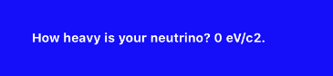

## Getting started

We're going to start with a very simple component to get familiar with **Render**'s programming model.

```swift
class SimpleCounterComponent: UIComponent<UINilState, UINilProps> {

  /// Define your component hierarchy in the *render* method.
  override func render(context: UIContextProtocol) -> UINodeProtocol {
  
    let container = UINode<UIView>(layoutSpec: containerLayoutSpec)
    let label = UINode<UILabel>(layoutSpec: labelLayoutSpec)
    
    return container.children([
      label,
    ])
  }

  private func containerLayoutSpec(_ spec: UINode<UIView>.LayoutSpec) {
    // *spec* is a proxy to the rendered view and can be used to configure the backing view for
    // your node...
    spec.set(\UIView.backgroundColor, .blue)

    // ...if necessary you can access to the view directly e.g.
    spec.view.backgroundColor = .blue

    // Render uses facebook/yoga to compute view layouts.
    spec.set(\UIView.yoga.width, spec.canvasSize.width)
  }

  private func labelLayoutSpec(_ spec: UINode<UILabel>.LayoutSpec) {
    spec.set(\UILabel.textColor, .white)
    spec.set(\UILabel.yoga.margin, 32)
    spec.set(\UILabel.text, "Number of taps: 0")
  }
}
```

Now that we have our component, we need a `ViewController` to manage its life-cycle.

We use `UIComponentViewController`*, a specialised subclass of `UIViewController` for semplicity sake, but components can be virtually installed in any view hierarchy.

```swift
class SimpleCounterViewController: UIComponentViewController<SimpleCounterComponent> {

  override func buildRootComponent() -> SimpleCounterComponent1 {
    // We can create a new component using the ViewController's context.
    return context.component(SimpleCounterComponent.self)
  }
}
```

Voilà! We have our first component rendered on screen.


#### Adding a state to your component

Nothing happens when we tap on our component.
We want to change that, and to do so we need to introduce a state in the component:

```swift
class CounterState: UIState {
  var counter: Int = 0
}
```

Now we can change the class declaration to associate our component to the newly created state type, and change the state whenever the user interacts with the component.

```swift
class SimpleCounterComponent: UIComponent<CounterState, UINilProps> {
  [...]
  private func containerLayoutSpec(_ spec: UINode<UIView>.LayoutSpec) {
    [...]
    // We define a touch handler for the view.
    spec.view.onTap { [weak self] _ in
      // Whenever the view is being touched we increment the state counter... 
      self?.state.counter += 1
      // ...and re-render the component.
      self?.setNeedsRender()
    }
  }
  
  private func labelLayoutSpec(_ spec: UINode<UILabel>.LayoutSpec) {
    [...]
    // The label now shows the state counter.
    spec.set(\UILabel.text, "Number of taps: \(state.counter)")
  }
}
```


#### Passing props to your component

It's very common for your component to display data coming from a model, or more generally, from some state that is not internal to the component.
In **Render** we use props for that.

Let's imagine that we want to customise the prompt of our component.

```swift
class CounterProps: UIProps {
  var format: String =  "Number of taps: %d"
}
```

We then associate our component class to the newly defined props type.

```swift
class SimpleCounterComponent: UIComponent<CounterState, CounterProps> {
  [...]
  private func labelLayoutSpec(_ spec: UINode<UILabel>.LayoutSpec) {
    [...]
    spec.set(\UILabel.text, String(format: props.format, state.counter))
  }
}
```

Now the only thing left to do is to pass down the desired prop data to the component in you ViewController. 

```swift
class SimpleCounterViewController: UIComponentViewController<SimpleCounterComponent> {

  override func buildRootComponent() -> SimpleCounterComponent1 {
    let component = context.component(SimpleCounterComponent.self)
    // Component props are used to pass data from your model to your component.
    component.props.format = "How heavy is your neutrino? %d eV/c2."
    return component
  }
}
```


